<div align="center">

# 📡 WiFi-Radar

### Human Pose Estimation Through WiFi Signals

[](https://python.org)
[](https://pytorch.org)
[](https://onnx.ai)
[](docker/docker-compose.yml)
[](LICENSE)
[](pyproject.toml)
[](https://github.com/psf/black)

*Detect, track and analyse human poses through walls — no cameras required*

</div>

---

## Overview

WiFi-Radar is a Python research system for **WiFi-based human pose estimation,
tracking, fall detection, gait analytics, and headless monitoring**. It consumes
Channel State Information from commodity WiFi hardware or the built-in
simulation pipeline, transforms it into learned embeddings, and emits
17-keypoint 3-D pose outputs in real time.

### What WiFi-Radar Is, How It Works, and What It Finds

WiFi-Radar is a camera-free sensing system that uses normal WiFi signal reflections to infer human movement. Instead of images, it reads CSI (Channel State Information), which captures how radio waves change when people move, stand, walk, or fall in a room. That means the system can monitor activity without recording visual identity data.

At runtime, the pipeline works in five steps:

1. Collect CSI frames from a router or simulator.
2. Clean and normalize amplitude and phase signals.
3. Encode temporal signal patterns into pose features.
4. Decode features into 3-D human keypoints and stable person IDs.
5. Run behavior modules to produce fall, gait, anomaly, and activity outputs.

What the system finds in practice:

- **Who is present and where**: multi-person tracking with stable IDs.
- **How each person is moving**: stationary, walking, transition, high-motion.
- **Whether motion resembles a fall pattern**: state-machine and hybrid fall risk.
- **How gait is changing over time**: cadence, stride proxy, symmetry, speed.
- **Whether behavior is unusual**: rolling anomaly detection on gait trends.

This repository is designed for readable, explainable behavior analytics. The algorithms were selected so operators can inspect why a decision was made, tune thresholds per environment, and deploy on resource-constrained edge hardware.

This repository is aimed at **researchers, embedded/edge developers, and
privacy-first sensing prototypes** that need room-scale awareness without
cameras.

> [!IMPORTANT]
> The project now uses a **src layout**. The importable package lives in
> **src/wifi_radar**, while packaging and environment files stay at the repo root.

> [!TIP]
> Start with simulation mode first, then enable the REST API or RTMP stream as
> needed.

> [!NOTE]
> Detailed implementation and reference material now lives under the docs folder,
> keeping this README focused on the project, research context, and how to run it.

---

## Visual Gallery

The images below are repository hosted visuals that demonstrate what the system looks like during runtime. They are intentionally placed in `docs/images/` so they render correctly on GitHub, in forks, and in pull request previews. You can replace these SVG assets with real screenshots from your environment while keeping the same file names.

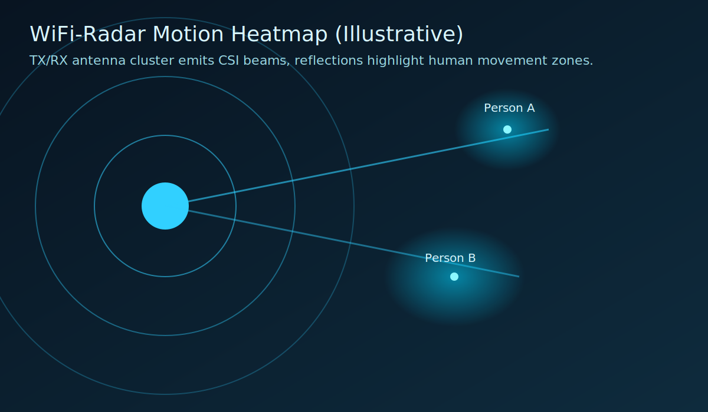

This view represents spatial motion energy around the antenna array. It helps explain where strong reflections are coming from and gives operators an immediate sense of movement intensity in the monitored room.

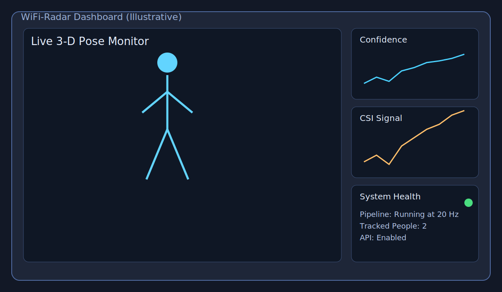

This panel style mirrors the live monitor experience, where 3-D skeleton estimation, confidence trends, and CSI traces are observed together to validate model health in real time.

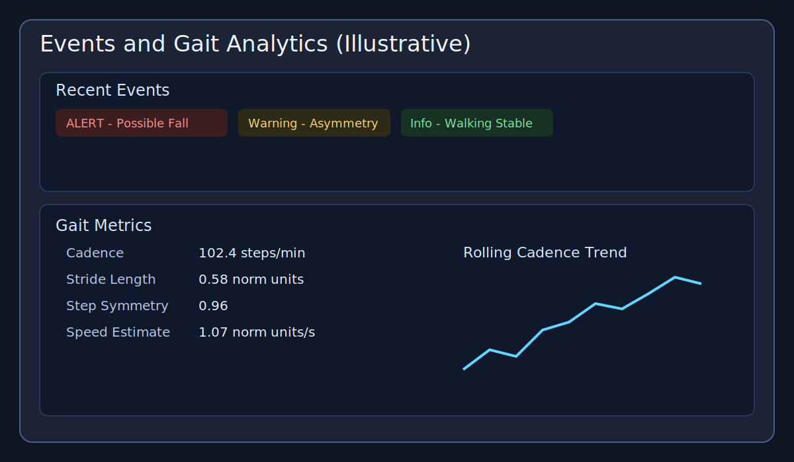

This event-centric view demonstrates how fall and gait signals are surfaced as actionable timeline events rather than raw numerical output.

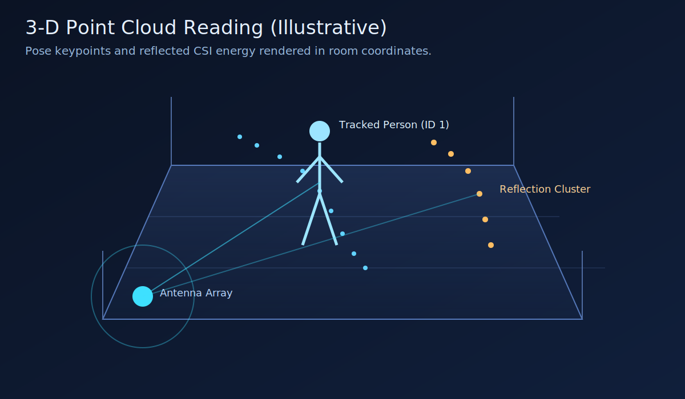

This point-cloud style visual approximates what WiFi-radar reflections and tracked keypoints look like in room coordinates. It is useful for communicating the distinction between raw RF reflection clusters and final pose estimates.

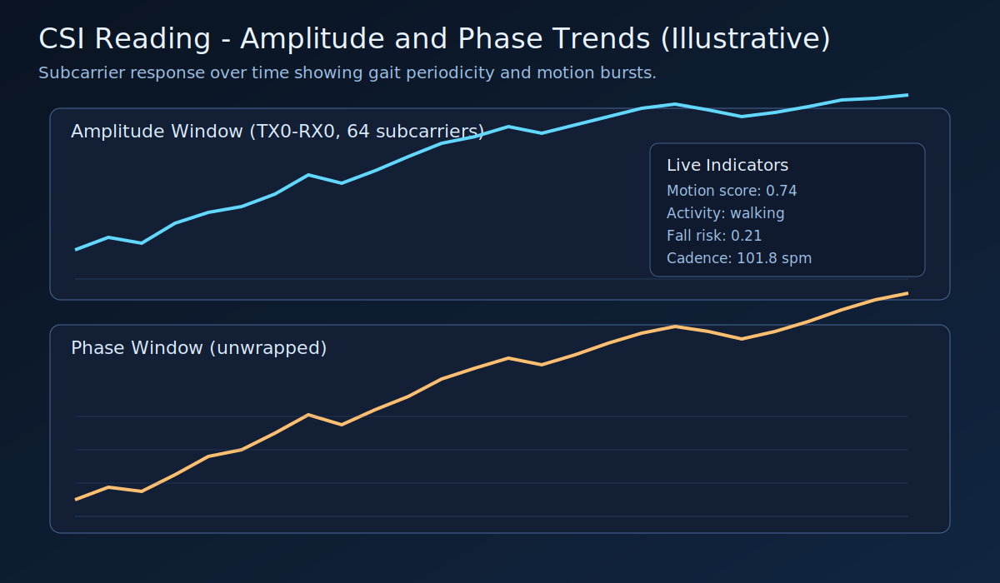

This chart illustrates typical CSI amplitude and phase trajectories over time, which are the core signals used by tracking, gait, anomaly, and fusion modules.

> [!TIP]
> If you capture real screenshots from production runs, use a consistent 16:9 size and keep labels visible so readers can quickly map screenshots to README sections.

## Table of Contents

- [Overview](#overview)
- [What WiFi-Radar Is, How It Works, and What It Finds](#what-wifi-radar-is-how-it-works-and-what-it-finds)
- [Visual Gallery](#visual-gallery)
- [Key Features](#key-features)
- [Architecture Overview](#architecture-overview)
- [Algorithms and Formula Summary](#algorithms-and-formula-summary)
- [Research Background](#research-background)
- [Technology Stack](#technology-stack)
- [Requirements](#requirements)
- [Quick Start](#quick-start)
- [Usage](#usage)
- [Multi-Person Tracking](#multi-person-tracking)
- [Fall Detection](#fall-detection)
- [Gait Analysis](#gait-analysis)
- [Gait Anomaly Detection](#gait-anomaly-detection)
- [Hybrid Activity Fusion](#hybrid-activity-fusion)
- [REST API and Headless Mode](#rest-api-and-headless-mode)
- [Transfer Learning on Real CSI](#transfer-learning-on-real-csi)
- [ONNX Export](#onnx-export)
- [TensorRT Deployment](#tensorrt-deployment)
- [Docker Deployment](#docker-deployment)
- [Project Structure](#project-structure)
- [Development](#development)
- [Roadmap](#roadmap)
- [Contributing](#contributing)
- [License](#license)

---

## Key Features

| <sub>Icon</sub> | <sub>Feature</sub> | <sub>Description</sub> | <sub>Impact</sub> | <sub>Status</sub> |
|---|---|---|---|---|
| <sub>📶</sub> | <sub>CSI collection</sub> | <sub>Real or simulated CSI frames with 3×3 MIMO support</sub> | <sub>High</sub> | <sub>✅ Stable</sub> |
| <sub>🧠</sub> | <sub>Dual-branch pose pipeline</sub> | <sub>Amplitude + phase encoder feeding temporal pose estimation</sub> | <sub>High</sub> | <sub>✅ Stable</sub> |
| <sub>👥</sub> | <sub>Multi-person tracking</sub> | <sub>Stable IDs via greedy centroid matching</sub> | <sub>High</sub> | <sub>✅ Stable</sub> |
| <sub>🚨</sub> | <sub>Fall detection</sub> | <sub>Velocity + body-angle state machine for alerts</sub> | <sub>High</sub> | <sub>✅ Stable</sub> |
| <sub>🚶</sub> | <sub>Gait analytics</sub> | <sub>Cadence, stride, symmetry, and speed metrics</sub> | <sub>High</sub> | <sub>✅ Stable</sub> |
| <sub>🩺</sub> | <sub>Gait anomaly detection</sub> | <sub>Rolling abnormality detection using gait metrics</sub> | <sub>Medium</sub> | <sub>🧪 Experimental</sub> |
| <sub>🔀</sub> | <sub>Hybrid CSI + pose fusion</sub> | <sub>Multi-window motion fusion with pose and gait cues for more robust live activity scoring</sub> | <sub>Medium</sub> | <sub>🧪 Experimental</sub> |
| <sub>🌐</sub> | <sub>REST API</sub> | <sub>Headless integration endpoints for status, config, events, and metrics</sub> | <sub>High</sub> | <sub>🧪 Experimental</sub> |
| <sub>⚡</sub> | <sub>ONNX and TensorRT export</sub> | <sub>Edge deployment path for Jetson-style hardware</sub> | <sub>High</sub> | <sub>🧪 Experimental</sub> |
| <sub>🧪</sub> | <sub>Transfer learning workflow</sub> | <sub>Fine-tune on real-world CSI datasets in NPZ format</sub> | <sub>High</sub> | <sub>🧪 Experimental</sub> |
| <sub>🐳</sub> | <sub>Docker deployment</sub> | <sub>App + RTMP stack via Compose</sub> | <sub>Medium</sub> | <sub>✅ Stable</sub> |

---

## Architecture Overview

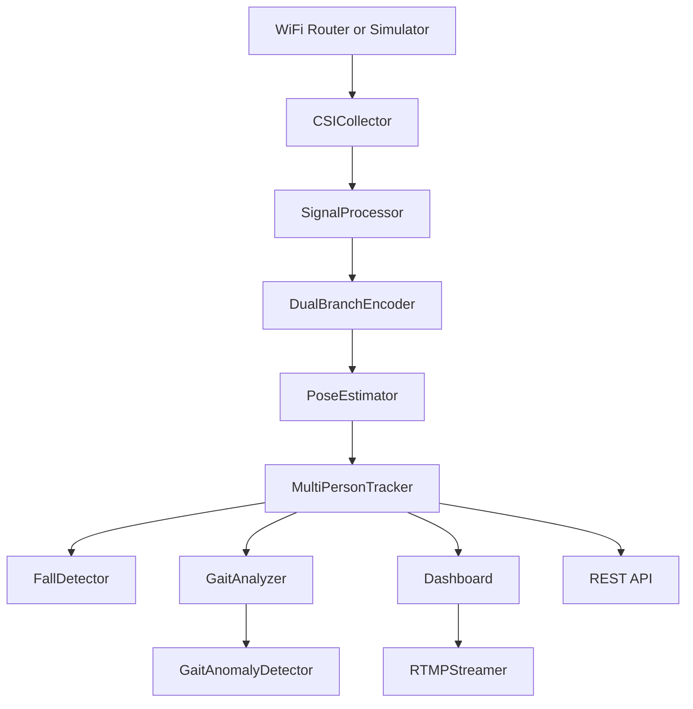

The runtime pipeline is organised around a single orchestration entry point in
**main.py**. CSI is collected, denoised, encoded, decoded into pose keypoints,
and then routed into tracking, fall analysis, gait analytics, optional anomaly
flagging, dashboard visualisation, RTMP streaming, and the optional REST API.

---

## Algorithms and Formula Summary

This section gives an at-a-glance technical summary of the core algorithms used in the behavior modules. The project favors methods that are easy to interpret, easy to tune in live deployments, and computationally efficient for edge systems. For each module, the chosen approach is paired with the primary equation and a short rationale versus common alternatives.

| Module | Algorithm | Core formula | Why this algorithm | Alternative and tradeoff |
|---|---|---|---|---|
| Multi-person tracking | Greedy centroid matching | $j^* = \arg\min_j \|c_t^{(i)} - c_{t-1}^{(j)}\|_2$ | Fast and stable for 1 to 4 occupants with low latency | Hungarian assignment can be globally optimal but is heavier and unnecessary at low N |
| Fall detection | Finite state machine with thresholds | $v_z < \tau_v$, $\theta > \tau_\theta$, $\frac{\Delta h}{h_0} > \tau_h$ | Interpretable and debuggable in real deployments | End-to-end fall classifiers are less transparent and harder to calibrate |
| Gait analysis | Peak-based step extraction | $\text{cadence} = \frac{N_{steps}}{\Delta t} \times 60$ | Robust and explainable from ankle trajectory dynamics | Sequence regressors hide failure modes and need more labeled data |
| Gait anomaly detection | Rolling z-score plus IsolationForest | $z_k = \frac{x_k - \mu_k}{\sigma_k + \epsilon}$ | Catches both single-metric spikes and multivariate drifts | Pure thresholding misses combined subtle abnormalities |
| Hybrid activity fusion | Multi-window weighted fusion | $s = \sum_w \alpha_w m_w,\; r = f(s,p,g,q)$ | Resilient when one signal stream becomes noisy | Single-window scoring is more sensitive to transient noise |

> [!IMPORTANT]
> These formulas define runtime behavior and engineering heuristics. They are not a clinical claim, and any safety critical deployment should include environment specific validation.

---

## Research Background

WiFi-Radar builds on the research thread around **RF sensing, CSI-based human
activity understanding, and privacy-preserving pose estimation**.

### Foundational work

| <sub>Paper</sub> | <sub>Venue</sub> | <sub>Contribution</sub> | <sub>Link</sub> |
|---|---|---|---|
| <sub>DensePose from WiFi</sub> | <sub>SIGCOMM 2022</sub> | <sub>Dense human pose recovery from commodity WiFi</sub> | <sub>[Paper](https://arxiv.org/abs/2301.00250)</sub> |
| <sub>Through-Wall Human Pose Estimation Using Radio Signals</sub> | <sub>CVPR 2018</sub> | <sub>Through-wall supervision and RF pose reasoning</sub> | <sub>[Paper](https://openaccess.thecvf.com/content_cvpr_2018/html/Zhao_Through-Wall_Human_Pose_CVPR_2018_paper.html)</sub> |
| <sub>WiFi Activity Recognition</sub> | <sub>IEEE Pervasive 2019</sub> | <sub>Deep learning on CSI for device-free activity inference</sub> | <sub>[Paper](https://ieeexplore.ieee.org/document/8713982)</sub> |
| <sub>WiPose</sub> | <sub>MobiSys 2020</sub> | <sub>3-D body pose estimation via commodity WiFi</sub> | <sub>[Paper](https://dl.acm.org/doi/10.1145/3386901.3388940)</sub> |

### Recent 2026 signals influencing this repo

| <sub>Date</sub> | <sub>Work</sub> | <sub>Why it matters here</sub> | <sub>Link</sub> |
|---|---|---|---|
| <sub>2026-01</sub> | <sub>Geometry-aware cross-layout WiFi pose estimation</sub> | <sub>Better generalisation across rooms and antenna layouts</sub> | <sub>[Paper](https://arxiv.org/abs/2601.12252)</sub> |
| <sub>2026-02</sub> | <sub>WiFlow</sub> | <sub>Lightweight continuous pose estimation with lower runtime cost</sub> | <sub>[Paper](https://arxiv.org/abs/2602.08661)</sub> |
| <sub>2026-02</sub> | <sub>WiPowerSys</sub> | <sub>Practical low-cost real-hardware capture workflow</sub> | <sub>[Paper](https://link.springer.com/article/10.1007/s13369-026-11172-7)</sub> |
| <sub>2026-04</sub> | <sub>MKFi</sub> | <sub>Multi-window temporal fusion for robust activity recognition</sub> | <sub>[Paper](https://www.sciencedirect.com/science/article/pii/S0031320325011756)</sub> |

### Project takeaway

Those newer results point in a consistent direction: **hybrid, layout-aware, and
lightweight WiFi sensing pipelines generalise better in real deployments**.
That is why this repository now emphasizes:

- live CSI validation and replay,
- hybrid CSI plus pose fusion,
- stronger headless and edge deployment paths.

For the longer bibliography and notes, see [docs/reference.md](docs/reference.md)
and [docs/recent_research_2026.md](docs/recent_research_2026.md).

---

## Technology Stack

| <sub>Technology</sub> | <sub>Purpose</sub> | <sub>Why Chosen</sub> | <sub>Alternatives</sub> |
|---|---|---|---|
| <sub>Python</sub> | <sub>Core runtime and tooling</sub> | <sub>Fast iteration for research systems</sub> | <sub>C++, Rust</sub> |
| <sub>PyTorch</sub> | <sub>Model training and inference</sub> | <sub>Flexible for CNN/LSTM experimentation</sub> | <sub>TensorFlow</sub> |
| <sub>SciPy + NumPy</sub> | <sub>Signal processing and numerical ops</sub> | <sub>Mature scientific stack</sub> | <sub>Custom DSP code</sub> |
| <sub>Dash + Plotly</sub> | <sub>Live monitoring UI</sub> | <sub>Fast interactive dashboarding</sub> | <sub>Streamlit, React</sub> |
| <sub>FastAPI + Uvicorn</sub> | <sub>Headless REST API</sub> | <sub>Typed endpoints and automatic docs</sub> | <sub>Flask</sub> |
| <sub>ONNX</sub> | <sub>Portable model export</sub> | <sub>Runtime-neutral deployment path</sub> | <sub>TorchScript</sub> |
| <sub>TensorRT</sub> | <sub>Jetson acceleration</sub> | <sub>Best NVIDIA edge inference performance</sub> | <sub>Plain ONNX Runtime</sub> |
| <sub>Docker + nginx-rtmp</sub> | <sub>Deployment and streaming</sub> | <sub>Reproducible stack and HLS playback</sub> | <sub>Bare-metal services</sub> |

---

## Requirements

### Software

- Python **3.9 – 3.11** (Docker image uses `python:3.11-slim`)
- Docker + Docker Compose (optional — for the full stack deployment)
- FFmpeg on the host system (for RTMP push without Docker)
- CUDA-capable GPU recommended; CPU-only works fine in simulation

### Hardware (real-world mode)

- 802.11n/ac access point with CSI extraction firmware
  - Atheros routers running OpenWrt + `ath9k` CSI patch
  - Intel 5300 NIC with [linux-80211n-csitool](https://github.com/spanev/linux-80211n-csitool)
  - 3×3 MIMO configuration (3 TX × 3 RX antennas)
- Linux host with a compatible wireless adapter

> **Tip:** Start with `--simulation` — no router, no GPU needed.

---

## Quick Start

### Option A — Python directly

```bash
# 1. Clone
git clone https://github.com/hkevin01/wifi-radar.git
cd wifi-radar

# 2. Create virtual environment
python -m venv .venv
source .venv/bin/activate          # Windows: .venv\Scripts\activate

# 3. Install runtime dependencies
pip install -r requirements.txt

# 4. Install the package in editable mode (recommended with the src layout)
pip install -e .

# 5. (Optional) Train simulation-baseline weights
python scripts/train_simulation_baseline.py

# 6. Run the dashboard pipeline
python main.py --simulation
```

### Option B — Docker (includes nginx-rtmp RTMP server)

```bash
docker compose -f docker/docker-compose.yml up --build
```

| <sub>Port</sub> | <sub>Service</sub> |
|---|---|
| <sub>**8050**</sub> | <sub>Dash dashboard</sub> |
| <sub>**1935**</sub> | <sub>RTMP ingest</sub> |
| <sub>**8080**</sub> | <sub>HLS playback + nginx stats</sub> |

HLS stream: `http://localhost:8080/hls/wifi_radar.m3u8`

---

## Usage

```bash
python main.py --simulation
python main.py --simulation --num-people 2 --api --headless
python main.py --router-ip 192.168.1.1 --rtmp-url rtmp://localhost/live/wifi_radar
```

### Flag reference

| <sub>Flag</sub> | <sub>Default</sub> | <sub>Description</sub> |
|---|---|---|
| <sub>`--simulation`</sub> | <sub>off</sub> | <sub>Use the built-in CSI simulator</sub> |
| <sub>`--num-people N`</sub> | <sub>`1`</sub> | <sub>Simulated people count</sub> |
| <sub>`--router-ip IP`</sub> | <sub>`192.168.1.1`</sub> | <sub>Real router address</sub> |
| <sub>`--router-port P`</sub> | <sub>`5500`</sub> | <sub>CSI TCP port</sub> |
| <sub>`--weights PATH`</sub> | <sub>auto</sub> | <sub>Checkpoint to load</sub> |
| <sub>`--export-onnx`</sub> | <sub>off</sub> | <sub>Export ONNX models and exit</sub> |
| <sub>`--dashboard-port P`</sub> | <sub>`8050`</sub> | <sub>Dash UI port</sub> |
| <sub>`--rtmp-url URL`</sub> | <sub>local RTMP URL</sub> | <sub>RTMP push target</sub> |
| <sub>`--house-visualization`</sub> | <sub>off</sub> | <sub>Enable pygame room view</sub> |
| <sub>`--api`</sub> | <sub>off</sub> | <sub>Enable the FastAPI REST service</sub> |
| <sub>`--api-host HOST`</sub> | <sub>`0.0.0.0`</sub> | <sub>API bind host</sub> |
| <sub>`--api-port P`</sub> | <sub>`8081`</sub> | <sub>API bind port</sub> |
| <sub>`--headless`</sub> | <sub>off</sub> | <sub>Run without blocking on the dashboard</sub> |
| <sub>`--record`</sub> | <sub>off</sub> | <sub>Save CSI frames to disk</sub> |
| <sub>`--output-dir DIR`</sub> | <sub>`~/wifi_data`</sub> | <sub>Recording output directory</sub> |
| <sub>`--replay FILE`</sub> | <sub>none</sub> | <sub>Replay a recorded session</sub> |
| <sub>`--config FILE`</sub> | <sub>user config path</sub> | <sub>YAML config file</sub> |
| <sub>`--debug`</sub> | <sub>off</sub> | <sub>Verbose logging</sub> |

### Common examples

```bash
# Simulation with two virtual people
python main.py --simulation --num-people 2

# Headless embedded mode with REST API only
python main.py --simulation --api --api-port 8081 --headless

# Export ONNX models for edge deployment
python main.py --export-onnx --weights weights/simulation_baseline.pth

# Start the full dashboard + RTMP pipeline
python main.py --simulation --rtmp-url rtmp://localhost/live/wifi_radar
```

> [!NOTE]
> When the API is enabled, interactive endpoint docs are available at
> **http://localhost:8081/docs** by default.

### Configuration file

```yaml
# ~/.wifi_radar/config.yaml  (also editable live from the Configuration tab)
router:
  ip: <YOUR_ROUTER_IP>
  port: 5500
  interface: wlan0
  csi_format: atheros        # "atheros" | "intel"

system:
  simulation_mode: true
  debug: false
  max_people: 4
  confidence_threshold: 0.30
  data_dir: ~/.wifi_radar/data

dashboard:
  port: 8050
  update_interval_ms: 100
  max_history: 100

streaming:
  rtmp_url: rtmp://localhost/live/wifi_radar
  fps: 30
  bitrate: "1000k"

fall_detection:
  enabled: true
  velocity_threshold: -0.20   # normalised units / second  (negative = downward)
  angle_threshold_deg: 40.0   # body-from-vertical angle to trigger possible-fall
  alert_timeout_s: 5.0        # seconds without recovery before escalating to ALERT
```

---

## Pre-Trained Weights

A simulation-baseline checkpoint can be generated in ~2 minutes on CPU:

```bash
python scripts/train_simulation_baseline.py
# → writes weights/simulation_baseline.pth
```

Advanced options:

```bash
python scripts/train_simulation_baseline.py \
  --epochs 200 \
  --n-samples 20000 \
  --batch-size 128 \
  --lr 5e-4 \
  --output-dir weights
```

`main.py` loads `weights/simulation_baseline.pth` automatically on startup if it
exists.

---

## Multi-Person Tracking

The runtime maintains stable person identities across frames so the monitoring stack can follow multiple occupants and associate alerts with the correct person. This is critical because every downstream module is person-scoped. If identity switches occur, the fall detector, gait history, and anomaly history become mixed across people and produce incorrect alerts.

The tracker uses a greedy centroid matching policy between frame $t-1$ and frame $t$. For each current detection centroid $c_t^{(i)}$, the nearest previous centroid is selected under a match distance threshold:

$$
j^* = \arg\min_j \|c_t^{(i)} - c_{t-1}^{(j)}\|_2
$$

Only matches that satisfy $\|c_t^{(i)} - c_{t-1}^{(j^*)}\|_2 < d_{max}$ are accepted. Unmatched tracks age out, and unmatched detections create new IDs.

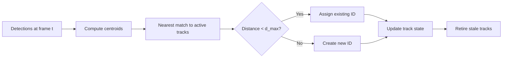

| Choice | Why it is used here | Alternative |
|---|---|---|
| Greedy nearest-centroid | Very low latency and easy to debug with small person counts | Hungarian matching |
| Fixed match threshold | Predictable behavior during tuning and deployment | Learned association network |
| Track timeout aging | Avoids immediate ID loss during brief dropouts | Hard reset on miss |

> [!NOTE]
> For this project scale, deterministic behavior and simple calibration are more valuable than globally optimal assignment complexity.

---

## Fall Detection

Falls are detected from motion, posture change, and recovery state, then surfaced in both the dashboard and REST API event stream. The detector is a finite state machine (FSM), which was chosen because it is interpretable and easy to calibrate for different environments.

The detector combines three criteria:

$$
v_z < \tau_v, \quad \theta > \tau_\theta, \quad \frac{\Delta h}{h_0} > \tau_h
$$

- $v_z$ is vertical centroid velocity.
- $\theta$ is torso angle from vertical.
- $\Delta h/h_0$ is normalized height drop from the standing baseline.

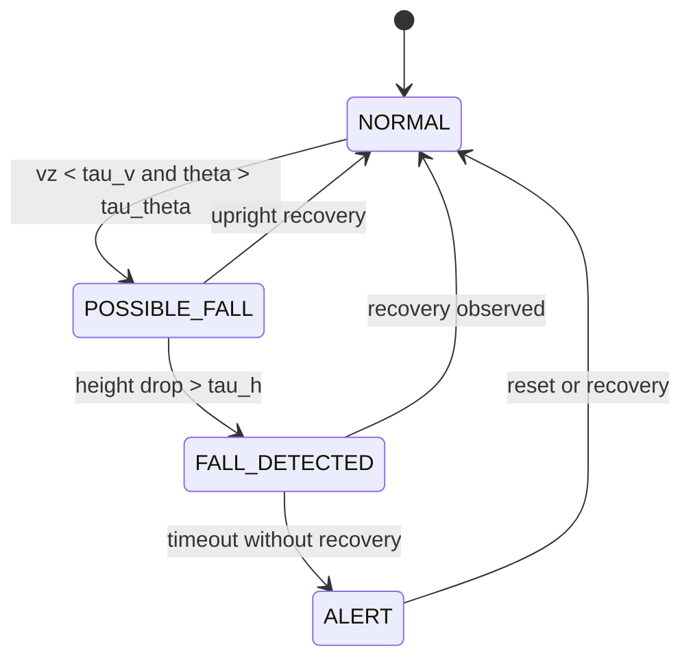

| Signal | Why it matters | Failure mode if omitted |
|---|---|---|
| Vertical velocity | Captures sudden downward movement | Slow collapses can be missed |
| Body angle | Distinguishes bending from falling | Many bend events become false alerts |
| Height drop ratio | Confirms meaningful posture collapse | High-motion events over-trigger |

> [!WARNING]
> This is an engineering fall risk detector, not a medical certified fall diagnosis system.

---

## Gait Analysis

The system estimates cadence, stride, symmetry, and walking-speed proxies from the rolling pose stream for continuous mobility monitoring. It uses ankle trajectory minima as step events because foot strike naturally appears as a local minimum in ankle height.

Cadence is computed as:

$$
  ext{cadence}_{spm} = \frac{N_{steps}}{\Delta t} \times 60
$$

Symmetry is computed as a ratio between left and right step intervals:

$$
  ext{symmetry} = \frac{\overline{T}_{left}}{\overline{T}_{right}}
$$

| Metric | Formula or method | Why chosen |
|---|---|---|
| Cadence | step count per time window | Stable and easy to interpret clinically |
| Stride length proxy | distance between same-foot strikes | Works without explicit floor plane model |
| Step symmetry | mean left/right interval ratio | Sensitive to limping and imbalance |
| Speed estimate | hip midpoint displacement over time | Low-noise compared with ankle-only speed |

> [!TIP]
> Peak detection is robust in noisy CSI settings and gives explainable metrics that are easy to compare across sessions.

---

## Gait Anomaly Detection

Unusual gait changes are flagged using rolling statistics and lightweight outlier detection to provide an early warning signal. The detector combines robust z-score checks with an optional IsolationForest model for multi-feature anomalies.

For each gait feature $x_k$:

$$
z_k = \frac{x_k - \mu_k}{\sigma_k + \epsilon}
$$

If $|z_k| > z_{thr}$ for key metrics, an anomaly reason is recorded. IsolationForest adds a multivariate perspective for gradual combined drifts that single thresholds may miss.

| Detection layer | Strength | Weakness |
|---|---|---|
| Rolling z-score | Transparent per-metric reasoning | Less sensitive to weak multivariate shifts |
| IsolationForest | Captures joint feature drift | Less interpretable than direct thresholds |

> [!IMPORTANT]
> Warm-up samples are required before anomaly output is meaningful. Early frames are baseline-building, not decision-grade.

---

## Hybrid Activity Fusion

A recent addition combines CSI motion evidence, pose confidence, and gait signals into a more robust live activity estimate for walking, stationary, high-motion, transition, and possible-fall states. This module improves stability when one modality briefly drops in quality.

Motion is scored across multiple windows and fused with weighted coefficients:

$$
s = \sum_{w \in W} \alpha_w m_w, \qquad \sum_{w \in W} \alpha_w = 1
$$

Final risk is produced from fused motion, pose reliability, gait context, and geometry factor:

$$
r = f(s, p, g, q)
$$

where $p$ is pose reliability, $g$ is gait context, and $q$ is layout quality metadata.

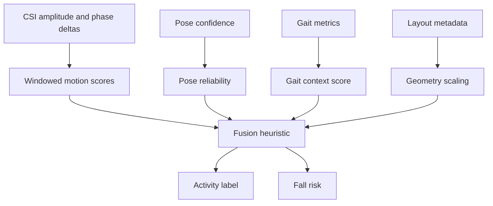

| Fusion component | Why included | What it protects against |
|---|---|---|
| Multi-window motion | Captures both short and sustained movement | One-frame spikes and dropouts |
| Pose reliability term | Discounts low-confidence keypoint periods | Skeleton jitter from weak signal |
| Gait context term | Anchors classification to mobility pattern | Mislabeling fast transitions |
| Geometry scaling | Adapts confidence to antenna setup quality | Overconfidence in poor layouts |

> [!NOTE]
> Hybrid outputs are published into both `gait_metrics` and `csi_summary` so API clients can consume a single coherent state packet.

---

## REST API and Headless Mode

WiFi-Radar can now run without the dashboard for embedded or service-style integrations. In headless mode, the processing pipeline continues to ingest CSI, run inference, and publish events and metrics to FastAPI. This pattern is useful for integrations such as smart-home controllers, backend analytics pipelines, and edge gateways where a browser dashboard is not required.

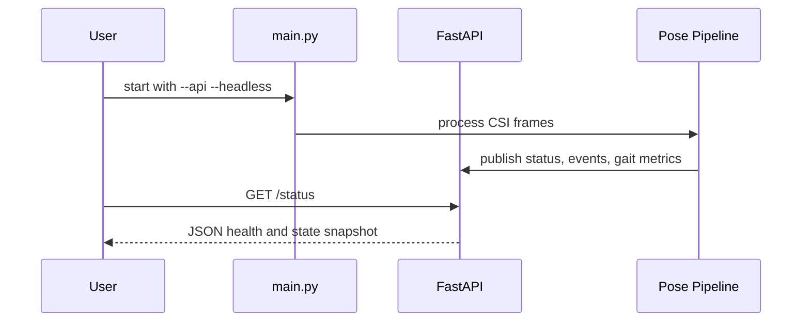

<details>
<summary><strong>Full API Reference (click to expand)</strong></summary>

| Method | Endpoint | Purpose | Typical response fields |
|---|---|---|---|
| `GET` | `/` | Service identity and docs path | `service`, `docs` |
| `GET` | `/health` | Liveness and uptime check | `status`, `uptime_s` |
| `GET` | `/status` | Runtime summary | `tracked_count`, `event_count`, `simulation_mode` |
| `GET` | `/config` | Current merged runtime config | `config` |
| `POST` | `/config` | Patch runtime config in memory | `config` |
| `POST` | `/ingest` | Push pipeline snapshots and events | `accepted`, `tracked_count`, `event_count` |
| `GET` | `/people` | Tracked people with keypoints and confidence | `tracked_people` |
| `GET` | `/events` | Recent fall and anomaly events | `events` |
| `GET` | `/metrics/gait` | Latest gait metrics packet | `gait_metrics` |

</details>

> [!TIP]
> Use `GET /status` for lightweight polling loops and `GET /events` for event-driven workflows. This combination keeps traffic low while still capturing all critical alerts.

> [!NOTE]
> `POST /config` updates in-memory runtime settings. The dashboard configuration save path persists settings to YAML and then propagates those values into runtime state.

Example:

```bash
python main.py --simulation --api --headless
curl http://localhost:8081/health
```

---

## Transfer Learning on Real CSI

For real-world adaptation, the repository now includes a transfer-learning
workflow that fine-tunes the simulation baseline on NPZ datasets containing:

- `amplitude`
- `phase`
- `keypoints`
- optional `confidence`

```bash
python scripts/train_transfer_learning.py data/real_world/*.npz \
  --weights weights/simulation_baseline.pth \
  --epochs 40 \
  --output weights/realworld_transfer.pth
```

The script starts with the simulation checkpoint, freezes the encoder for an
initial warm-up phase, then unfreezes the backbone for full fine-tuning.

---

## ONNX Export

Export both models for edge deployment with a single command:

```bash
# Export (requires onnx + onnxruntime)
python scripts/export_onnx.py --weights weights/simulation_baseline.pth

# Validates with onnxruntime automatically (max diff < 1e-4)
# → weights/encoder.onnx
# → weights/pose_estimator.onnx
```

Or via the main entry point:

```bash
python main.py --export-onnx --weights weights/simulation_baseline.pth
```

The exported models use **opset 17** and include **dynamic batch axes**, making
them suitable for Jetson Nano, Raspberry Pi 4 with ONNX Runtime, or any
ONNX-compatible inference engine.

```python
import onnxruntime as ort
import numpy as np

sess = ort.InferenceSession("weights/encoder.onnx", providers=["CPUExecutionProvider"])
features = sess.run(["features"], {"amplitude": amp_np, "phase": phase_np})[0]
```

---

## TensorRT Deployment

For Jetson-class hardware, WiFi-Radar now includes a helper script that builds
TensorRT engine plans from the exported ONNX models using **trtexec**.

```bash
python scripts/export_tensorrt.py \
  --precision fp16 \
  --output-dir weights/tensorrt
```

This path is best suited to **Jetson Nano / Xavier / Orin** systems where the
TensorRT runtime is already installed.

> [!WARNING]
> TensorRT engine generation is hardware-specific. Build the engine on the same
> class of NVIDIA target device you plan to deploy on.

---

## Docker Deployment

The full stack (WiFi-Radar + nginx-rtmp RTMP server) runs with one command:

```bash
docker compose -f docker/docker-compose.yml up --build
```

**Services:**

| <sub>Container</sub> | <sub>Image</sub> | <sub>Role</sub> |
|---|---|---|
| <sub>`wifi-radar-app`</sub> | <sub>built from `docker/Dockerfile`</sub> | <sub>Python 3.11 app, port 8050</sub> |
| <sub>`wifi-radar-rtmp`</sub> | <sub>`alfg/nginx-rtmp`</sub> | <sub>RTMP ingest 1935, HLS 8080</sub> |

**Watch the stream in a browser:**
```
http://localhost:8080/hls/wifi_radar.m3u8
```

**Check nginx-rtmp stats:**
```
http://localhost:8080/stat
```

Weights and config are persisted in named Docker volumes
(`wifi_radar_weights`, `wifi_radar_config`).

---

## Dashboard

The Dash dashboard at **http://localhost:8050** has three tabs:

### 📊 Live Monitor
- Real-time 3-D skeleton (Plotly Scatter3d)
- Confidence history and people-count chart
- CSI amplitude + phase signal (TX0·RX0)
- System status indicator

### 🚨 Events
- Fall alert feed with severity badge and timestamp
- Gait metrics table (cadence, stride, symmetry, speed, step count)
- Updates every 2 seconds

### ⚙️ Configuration
- Live-editable settings: router IP, simulation toggle, confidence threshold,
  max people, RTMP URL, stream FPS, fall-detection thresholds
- **Save** writes `~/.wifi_radar/config.yaml` and notifies the running system
- No restart required for most settings

---

## Project Structure

```text
wifi-radar/
├── main.py
├── src/
│   └── wifi_radar/
│       ├── analysis/
│       │   ├── fall_detector.py
│       │   ├── gait_analyzer.py
│       │   └── gait_anomaly_detector.py
│       ├── api/
│       │   ├── __init__.py
│       │   └── app.py
│       ├── data/
│       │   └── csi_collector.py
│       ├── models/
│       │   ├── encoder.py
│       │   ├── multi_person_tracker.py
│       │   └── pose_estimator.py
│       ├── processing/
│       │   └── signal_processor.py
│       ├── streaming/
│       │   └── rtmp_streamer.py
│       ├── utils/
│       │   ├── code_quality.py
│       │   └── model_io.py
│       └── visualization/
│           ├── dashboard.py
│           └── house_visualizer.py
├── scripts/
│   ├── export_onnx.py
│   ├── export_tensorrt.py
│   ├── train_simulation_baseline.py
│   └── train_transfer_learning.py
├── tests/
│   ├── test_api.py
│   ├── test_csi_parser.py
│   └── test_gait_anomaly_detector.py
├── docker/
├── docs/
├── requirements.txt
├── requirements-dev.txt
├── pyproject.toml
└── setup.cfg
```

> [!NOTE]
> Only the importable Python package lives under **src/**. Build metadata,
> requirements files, Docker config, tests, and documentation stay at the repo root.

---

For deeper implementation notes and technical reference material, use
[docs/system_overview.md](docs/system_overview.md) and [docs/reference.md](docs/reference.md).

---

## Development

```bash
# Install runtime + dev tooling
pip install -r requirements.txt
pip install -r requirements-dev.txt
pip install -e .

# Install pre-commit hooks
pre-commit install

# Lint and format
./scripts/check_code.sh
black . && isort .

# Focused tests
pytest tests/ -v

# Coverage report
pytest --cov=src/wifi_radar --cov-report=term-missing

# Train the simulation baseline
python scripts/train_simulation_baseline.py

# Fine-tune on real CSI datasets
python scripts/train_transfer_learning.py data/real_world/*.npz

# Export for edge deployment
python scripts/export_onnx.py --weights weights/simulation_baseline.pth
python scripts/export_tensorrt.py --precision fp16
```

---

## Router Setup (Real-World Mode)

See the setup guide in [docs/# WiFi-Radar Setup Guide.md](docs/%23%20WiFi-Radar%20Setup%20Guide.md) for:

- Flashing OpenWrt firmware with CSI extraction patches
- Configuring `ath9k` or Intel 5300 CSI tools
- Streaming CSI frames to the collection host
- Antenna placement guidelines

> **Security note:** The CSI streaming port (default 5500) and the RTMP port
> (1935) should be firewall-restricted to your local network only.

---

## Changelog

### v1.0.0
- Initial release: CSI collection, simulation mode, signal processing, dual-branch CNN encoder
- LSTM pose estimator (17 keypoints, 3-D) with multi-person tracking
- Fall detection (4-state FSM) and gait analysis (cadence, stride, symmetry, speed)
- 3-tab Dash dashboard — Monitor, Events, Configuration
- RTMP streaming via FFmpeg subprocess
- ONNX export with onnxruntime validation
- Docker stack with nginx-rtmp + HLS playback
- Simulation-baseline training script

### Current repository additions
- REST API for headless and embedded deployment
- Gait anomaly detection using rolling metrics and unsupervised outlier scoring
- Transfer-learning script for real-world CSI datasets
- TensorRT export helper for Jetson-class devices
- Focused automated tests with coverage reporting
- src-based package layout cleanup

---

## Roadmap

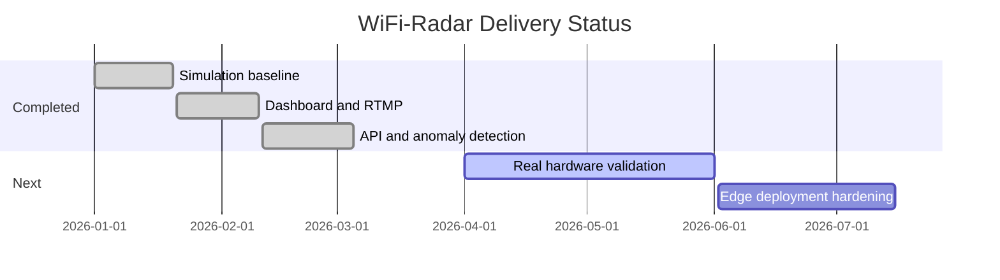

- [x] Pre-trained model weights (simulation baseline)
- [x] Multi-person pose clustering
- [x] Fall detection and gait analysis
- [x] ONNX export for edge deployment
- [x] Docker container with RTMP server included
- [x] Web UI configuration panel
- [x] Transfer learning from real-world CSI datasets
- [x] TensorRT optimisation for Jetson Nano deployment
- [x] REST API for headless / embedded integration
- [x] Automated test suite with coverage reporting
- [x] Anomaly detection for unusual gait patterns
- [x] Extended real-hardware validation against live CSI captures
- [x] Broader end-to-end regression coverage across the dashboard and streaming stack

---

## Contributing

Pull requests are welcome! Please read
[.github/CONTRIBUTING.md](.github/CONTRIBUTING.md) first.  For major changes,
open an issue to discuss what you'd like to change.

---

## License

This project is licensed under the **MIT License** — see [LICENSE](LICENSE) for
details.

---

<div align="center">
Built with 📡 WiFi signals and 🧠 deep learning
</div>